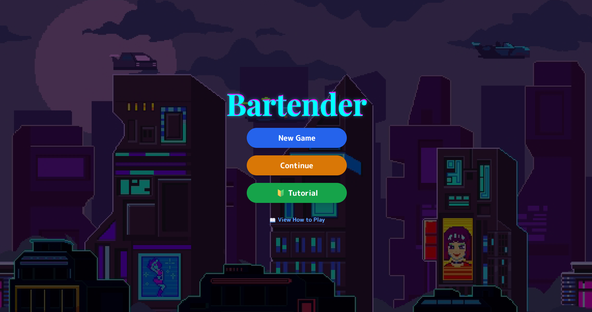
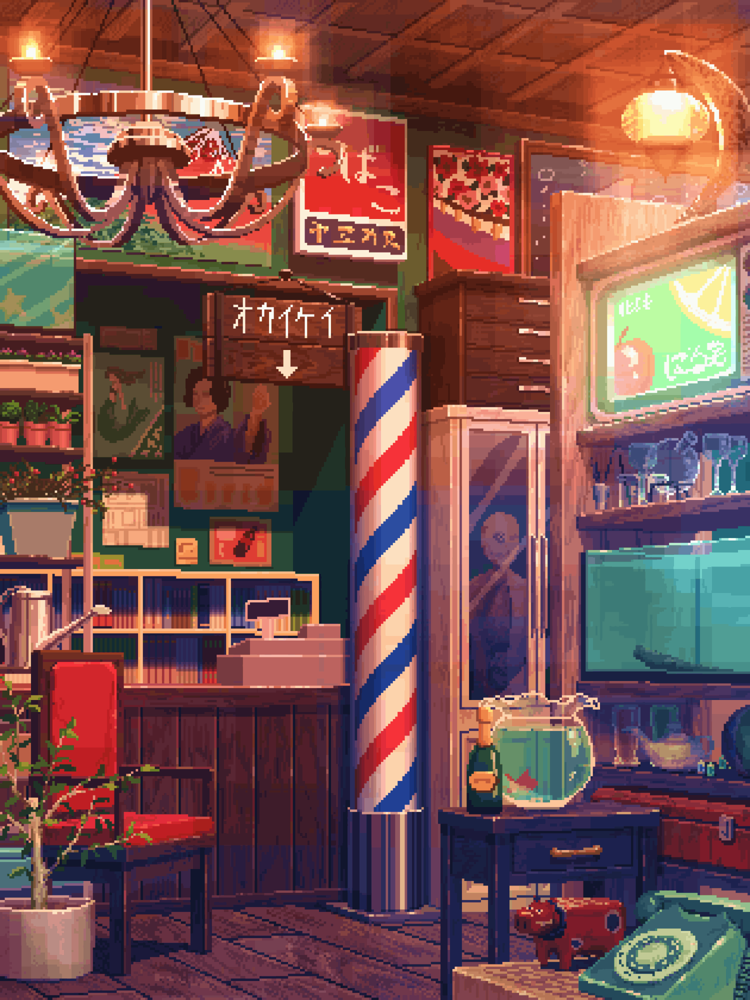

# 🍸 Bartender Game 🍹  
**シンプルで楽しいブラウザベースのバーテンダーシミュレーションゲーム**

**PCでのプレイ推奨です。画面サイズを67%に設定すると、ちょうど良いサイズで遊べます。**

  <i>「あなたはバーのマスター。注文通りにカクテルを作り、最高のバーテンダーを目指しましょう！」</i>

---

## 🎮 今すぐプレイ

**▶️ [クリックしてプレイ](https://imshota1009.github.io/Bartender/)**

---

## ✨ 特徴

- 🍹 **インタラクティブなカクテル作り**  
  材料を選び、氷を入れ、直感的な操作でシェイクします。

- 🥂 **リアルな演出**  
  液体が混ざり合う様子や注ぐ動作のアニメーションで、没入感のある体験を提供します。

- 👤 **個性豊かなお客様**  
  様々な職業のお客様が登場し、それぞれ異なるセリフや反応を見せます。

- 🎵 **ジュークボックス (BGM選択)**  
  ジャズ、中世風、酒場風など、BGMを変えてバーの雰囲気を楽しめます。

- 🌃 **美しいデザイン**  
  ムーディーなバーの背景とスタイリッシュなフォントが雰囲気を盛り上げます。

- 🏠 **バーの内装カスタマイズ**  
  壁紙（クラシック/モダン/ファンタジー）や照明（暖色/寒色/ネオン）を変更して、自分だけのバーを作れます！

- 📚 **図鑑 & 称号**
  カクテルやお客様のプロフィールを集めて図鑑を埋めましょう。プレイするにつれて特別な称号もアンロックされます！

- 🎓 **チュートリアルモード** 
  マスターバーテンダーから、ステップバイステップでバーテンディングの基礎を学べます。

- 💾 **セーブ機能** 
  1日の終わりにスロット1へ自動的に進行状況が保存されます。（スロット2・3は近日公開予定！）

- 📸 **フォトモード**  
  作ったカクテルのスクリーンショットを撮って、X (旧Twitter) や LINE でシェアしましょう！

- 📱 **ジェスチャーシェイク**  
  スマホを振ってカクテルをシェイク！加速度センサーを使用したリアルな動きに対応しています。

- 🌦️ **天気 & イベント**  
  ダイナミックな天候変化（晴れ/雨/雪）や季節のイベントがゲームプレイに影響を与えます。

- 🍺 **酔っ払いシステム**  
  お客様の酔い具合に注目してください。お酒が進むにつれて呂律が回らなくなります！

---

## 🕹️ 遊び方

1. **ゲームスタート**  
   「START」を押して開店するか、「TUTORIAL」で基本を学びましょう！

2. **注文を確認**  
   お客様が「称号」と「カクテル名」、そして色によるヒントを提示します。

3. **材料を選ぶ**  
   下の棚にあるボトルをクリックして、シェイカーに入れます。

4. **氷を入れる**  
   ほとんどのカクテルには氷が必要です。専用ボタンで追加しましょう。

5. **シェイク！**  
   - 🖱️ 「Shake!」ボタンをクリック
   - 📷 カメラモード（手のジェスチャーでシェイク）
   - 📱 ジェスチャーモード（スマホを振ってシェイク！）

6. **提供 & 結果**  
   - ✅ 成功 → スコアアップ & お客様の満足度上昇  
   - ❌ 失敗 → スコアダウン、やり直し可能  
   - ⏰ 時間切れ → スコアを競いましょう！

---

## 📱 モバイル機能

- **ジェスチャーシェイク**: 📱 ボタンをタップ → スマホを5回振って完了！
- **フォトモード**: 📸 ボタンをタップ → スクリーンショット撮影 → SNSでシェア
- **タッチ操作**: すべてのボタンがモバイルのタッチ操作に最適化されています

---

## 🛠️ 使用技術

  
  
  
  
  
  
  

---

## 🚀 今後の改善予定

- オンラインランキング機能
- 壁紙と照明テーマの追加
- **複数スロットセーブシステムの実装（スロット2 & 3）**
- 顧客キャラクターとカクテルレシピの追加

---

  
🍸 今夜の最高の一杯は、あなたの腕にかかっています 🍸

